<!-- ===================================================== -->

<!--                       HERO SECTION                    -->

<!-- ===================================================== -->

<a id="top"></a>

<div align="center">

<table>
<tr>
<td width="120" align="center">
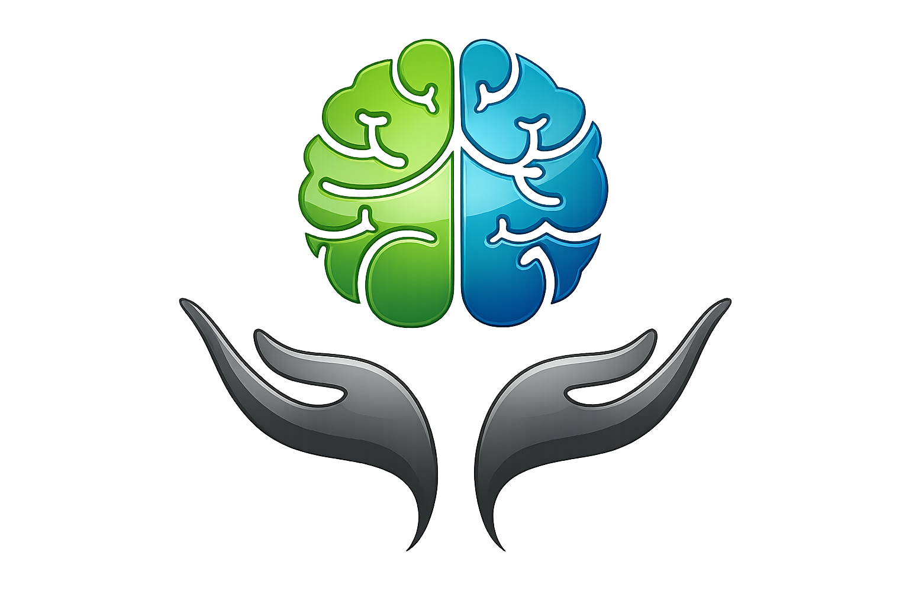
</td>

<td align="left">

# CogniSync

### Clinical Intelligence • Emotional Analytics • Wellness OS

*A privacy-first platform that transforms journaling, psychometric assessments, and AI-guided support into actionable mental wellness insights.*

</td>
</tr>
</table>

<br>

[](https://git.io/typing-svg)
<br>

<a href="https://cognisync.vercel.app/">

</a>

<a href="https://github.com/adithyachary09/cognisync">

</a>

<a href="https://linkedin.com/in/adithya-chary">

</a>

<br><br>


</div>

---

# Overview

Mental wellness platforms often force users to choose between accessibility, intelligence, and privacy. Most either provide static questionnaires with little interpretation or rely heavily on cloud-dependent experiences that overlook the human context behind the data.

**CogniSync** was built to bridge that gap.

It combines structured psychometric assessments, AI-powered emotional understanding, conversational support, and actionable wellness analytics into a unified experience designed to help users better understand their psychological patterns over time.

Rather than simply collecting data, CogniSync helps users answer meaningful questions:

* *How have I actually been feeling lately?*
* *Are there patterns in my emotional wellbeing?*
* *When do I perform at my best?*
* *What interventions may help me regulate during difficult moments?*

The result is a privacy-conscious **Wellness Operating System** that transforms scattered emotional signals into understandable, actionable insights.

---

# Why CogniSync Matters

Modern mental health experiences are often fragmented.

Users journal in one application, complete assessments somewhere else, seek support from another service, and rarely receive a holistic view of their wellbeing.

CogniSync brings these disconnected experiences together through thoughtful product engineering:

* Clinical screening tools.
* Emotion-aware journaling.
* AI-assisted conversations.
* Wellness reporting.
* Crisis intervention resources.
* Somatic regulation exercises.

All within a single, cohesive ecosystem.

---

# Highlights

* 🧠 **Clinical Intelligence Layer** combining standardized psychometric assessments with behavioral trends.

* 🤖 **Dual-AI Integration** using Hugging Face NLP classification alongside Google's Gemini conversational intelligence.

* 🔒 **Privacy-First Architecture** with aggressive local-first persistence and resilient synchronization strategies.

* 📊 **Actionable Wellness Analytics** that convert raw emotional inputs into understandable reports and trends.

* ⚡ **Serverless Full-Stack Design** powered by Next.js App Router and Supabase.

* 🎯 **Human-Centered Product Thinking** focused on usefulness, clarity, and emotional accessibility.

* 🚨 **Built-In Crisis Support Mechanisms** including emergency resources and evidence-backed regulation exercises.

---

# At a Glance

<table>
<tr>
<td width="50%">

### Built For

* Individuals tracking emotional wellbeing
* Users seeking structured self-reflection
* People exploring psychological patterns
* Developers interested in health-focused products
* Recruiters evaluating engineering maturity

</td>

<td width="50%">

### Demonstrates

* Product Engineering
* Full-Stack Development
* AI Integration
* System Design
* Security Awareness
* Data Visualization
* UX Craftsmanship

</td>
</tr>
</table>

---
# 📸 Visual Showcase

> A guided walkthrough of the CogniSync experience — from understanding yourself to acting on meaningful insights.

---

## 1. Wellness Dashboard

The central command center that brings together emotional trends, recent activity, and wellness indicators into a single glance.

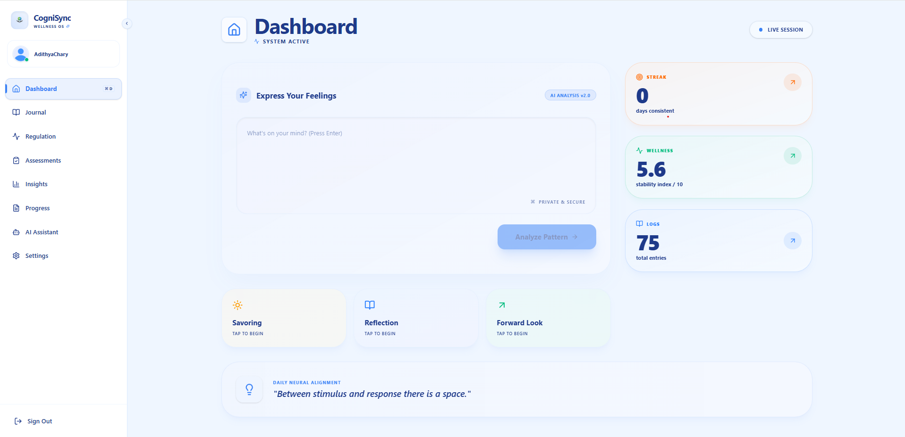

**Value Delivered:** Users immediately understand where they stand without digging through fragmented information.

---

## 2. Clinical Assessments Hub

Access evidence-based psychometric tools through an approachable and intuitive experience.

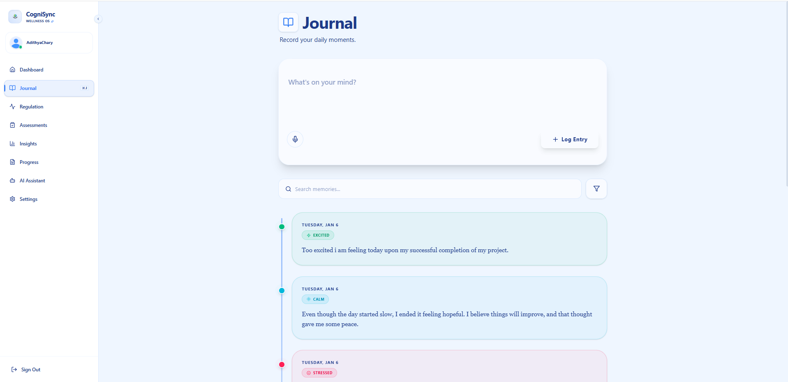

**Value Delivered:** Standardized assessments become accessible while preserving clarity and usability.

---

## 3. Guided Assessment Experience

A structured flow designed to reduce overwhelm and encourage thoughtful responses.

<table>
<tr>
<td width="50%">
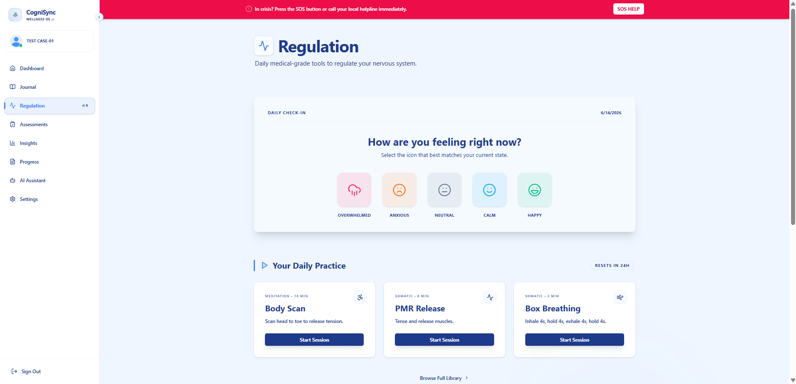

<p align="center">
<b>Assessment Introduction</b><br>
Users understand the purpose and expectations before beginning.
</p>

</td>

<td width="50%">
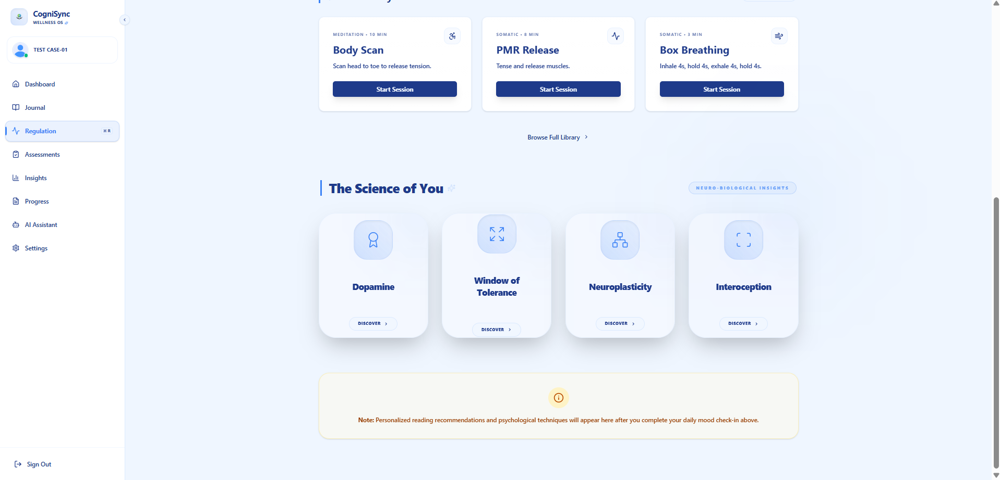

<p align="center">
<b>Active Assessment Session</b><br>
Timed evaluations promote focused and authentic responses.
</p>

</td>
</tr>
</table>

**Value Delivered:** Clinical rigor meets a user-friendly testing experience.

---

## 4. Emotional Journaling & Reflection

Transform free-form thoughts into structured emotional understanding.

<table>
<tr>
<td width="50%">
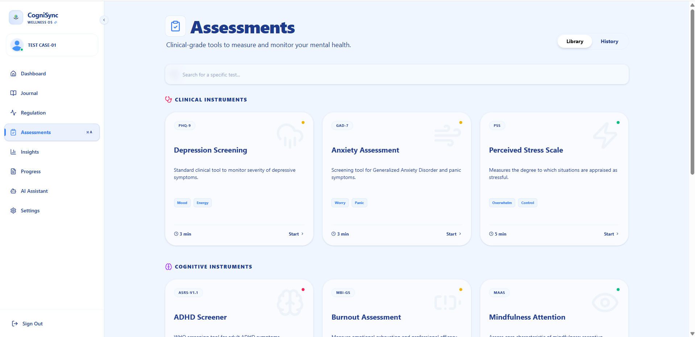

<p align="center">
<b>Thought Capture</b><br>
Users document experiences naturally without rigid constraints.
</p>

</td>

<td width="50%">
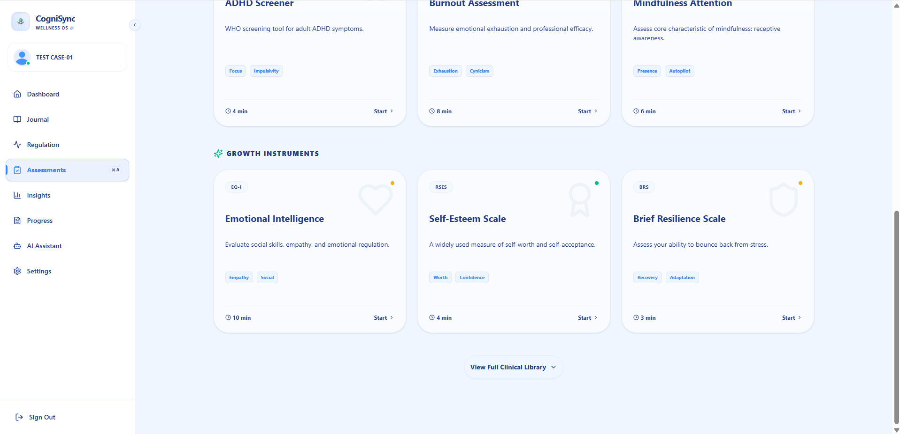

<p align="center">
<b>Emotion Classification</b><br>
AI identifies emotional patterns hidden within written reflections.
</p>

</td>
</tr>
</table>

**Value Delivered:** Journaling evolves from expression into measurable self-awareness.

---

## 5. Wellness Intelligence & Reporting

Raw data is transformed into actionable insights that users can actually understand.

<table>
<tr>
<td width="50%">
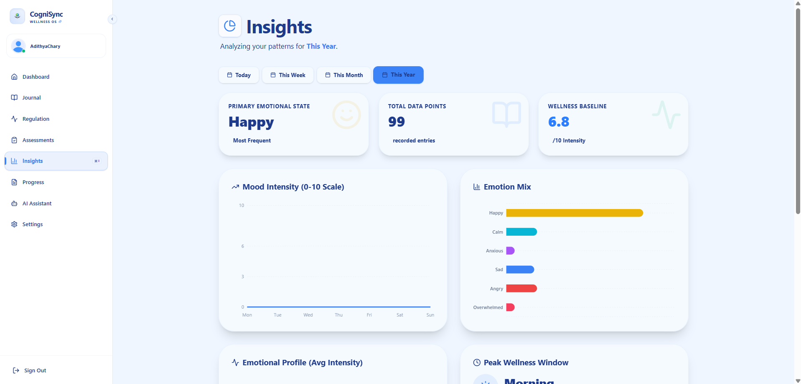

<p align="center">
<b>Behavioral Insights</b><br>
Historical patterns reveal strengths, vulnerabilities, and trends.
</p>

</td>

<td width="50%">
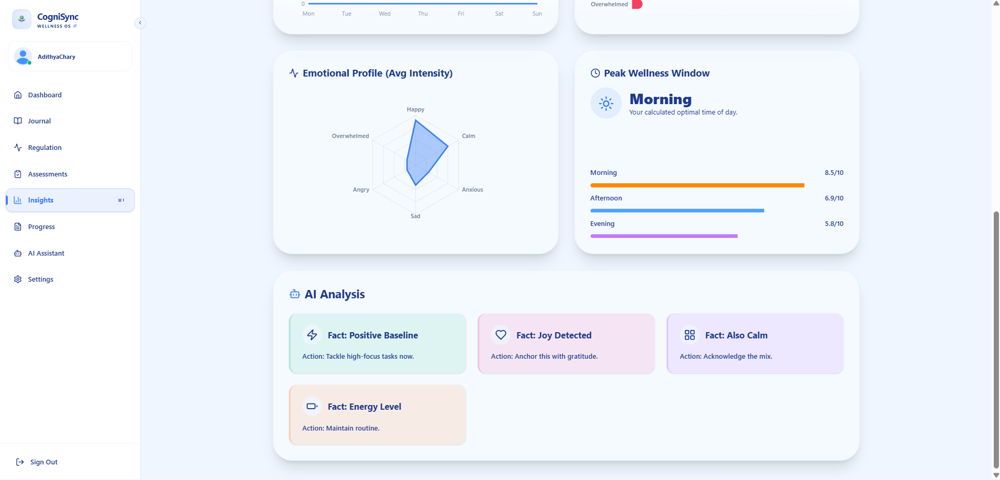

<p align="center">
<b>Progress Reporting</b><br>
Comprehensive summaries support reflection and informed decisions.
</p>

</td>
</tr>
</table>

**Value Delivered:** Information becomes guidance rather than noise.

---

## 6. AI Companion

Immediate conversational support designed around empathy, adaptability, and safety.

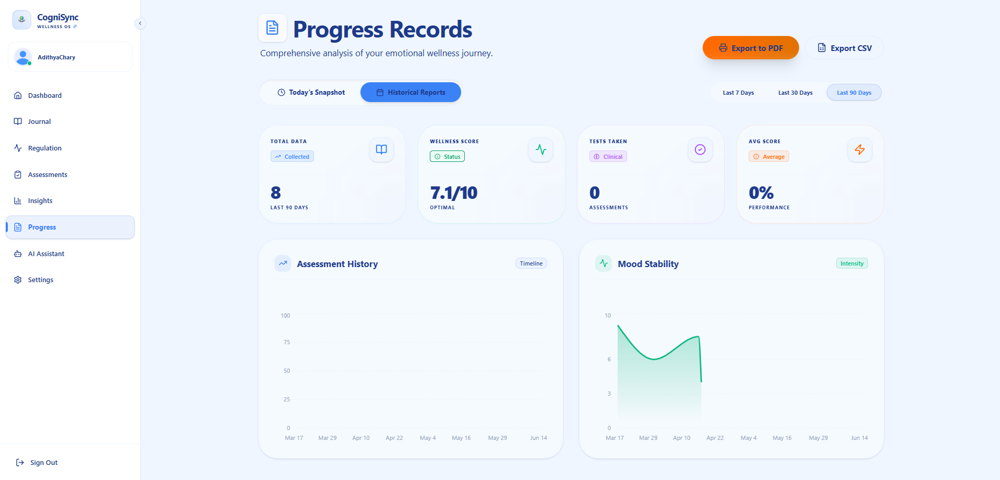

**Value Delivered:** Users gain a supportive space for reflection whenever they need it.

---

## 7. Crisis Support & Regulation

Resources designed for moments when immediate guidance matters most.

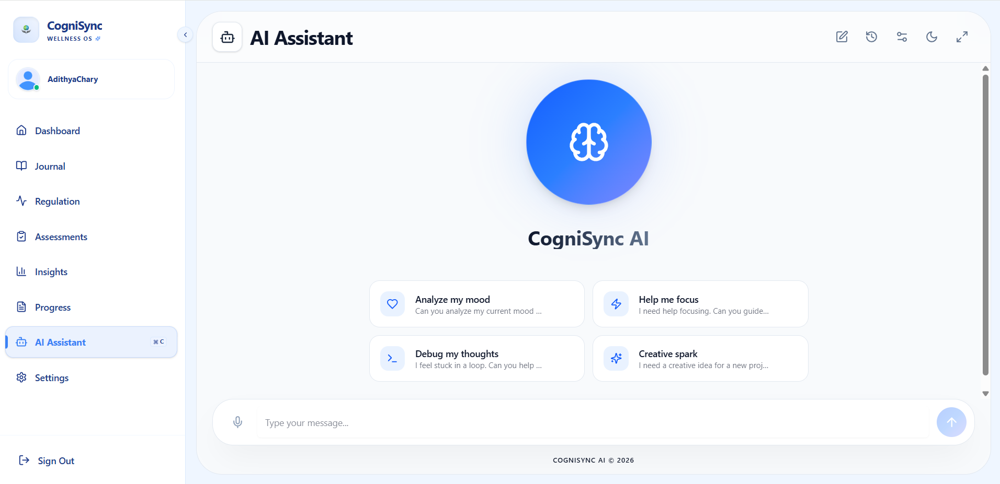

**Value Delivered:** Support extends beyond analytics into practical intervention.

---

## 8. Personalization & Account Experience

Control, customization, and trust-building through thoughtful account experiences.

<table>
<tr>
<td width="50%">
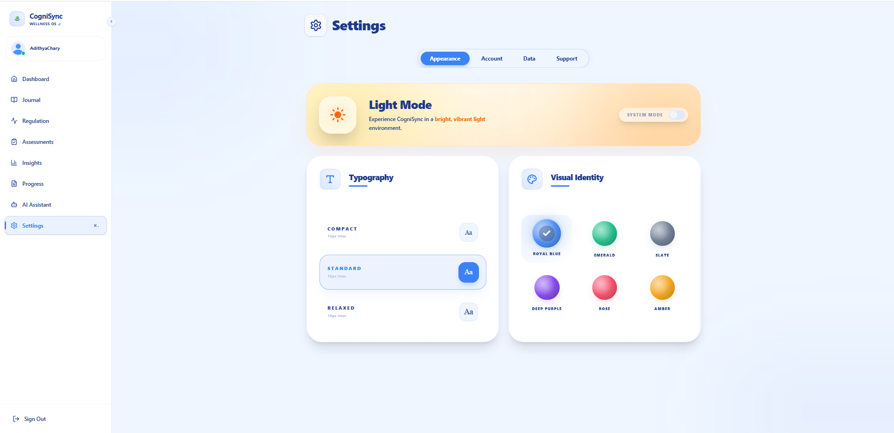

<p align="center">
<b>Profile Management</b><br>
Users shape their experience around their needs.
</p>

</td>

<td width="50%">
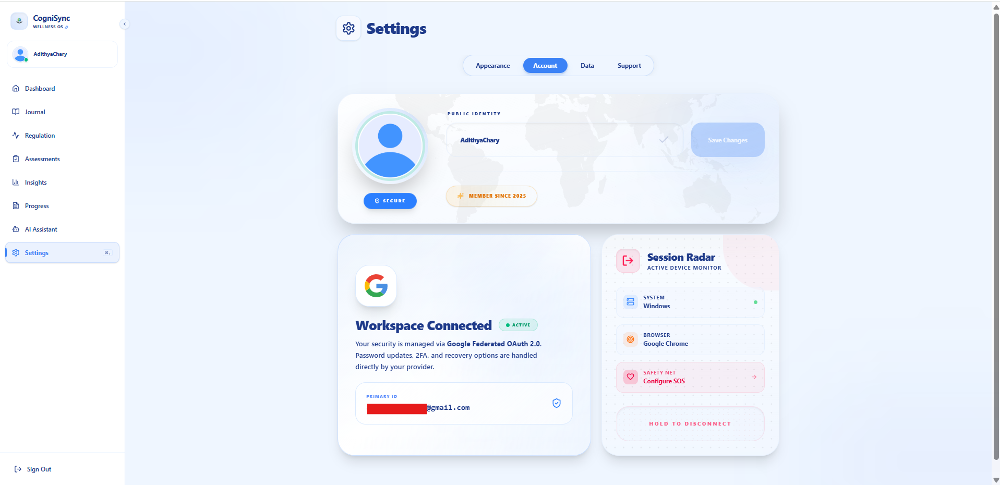

<p align="center">
<b>Preference Controls</b><br>
Behavior, themes, and experiences remain user-defined.
</p>

</td>
</tr>

<tr>
<td width="50%">
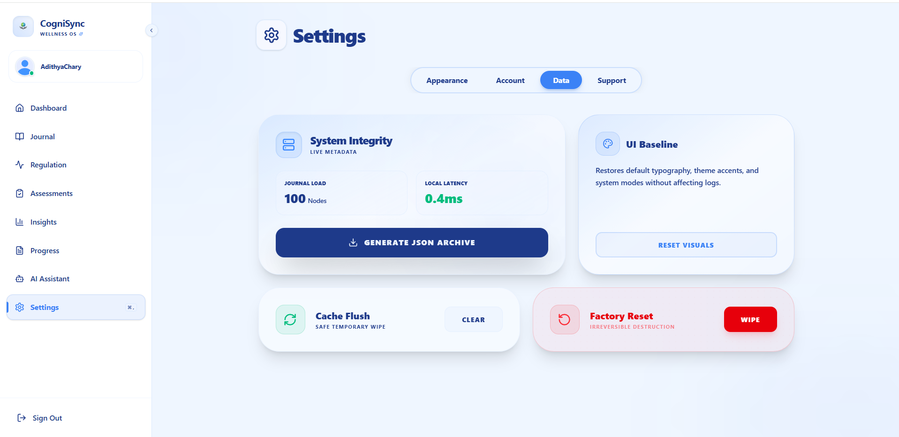

<p align="center">
<b>Security Settings</b><br>
Transparent controls reinforce confidence and ownership.
</p>

</td>

<td width="50%">
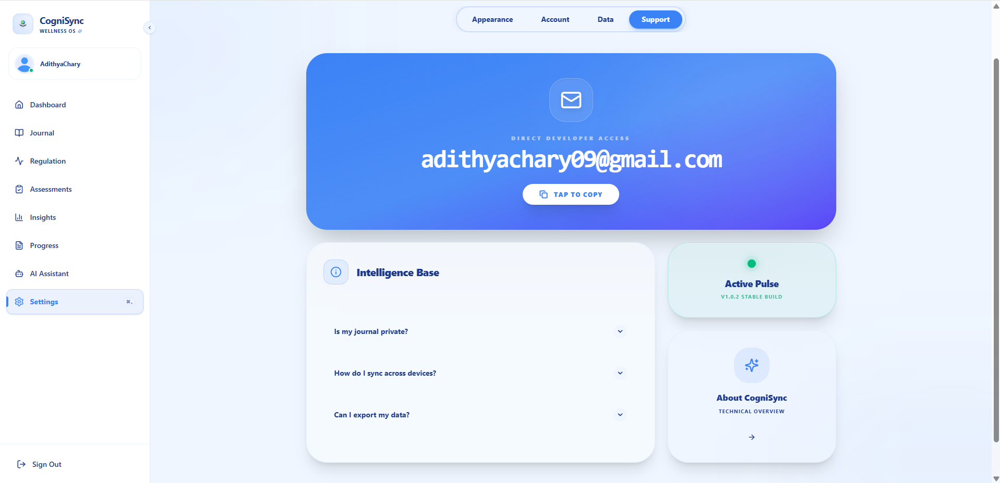

<p align="center">
<b>Account Experience</b><br>
Thoughtful details elevate everyday interactions.
</p>

</td>
</tr>
</table>

**Value Delivered:** Trust is built through transparency, control, and attention to detail.

---

# Recruiter Snapshot

### This Project Demonstrates

* Full-Stack Product Engineering
* AI & NLP Integration
* Clinical Data Visualization
* Authentication & Security Design
* Serverless Architecture
* State Management at Scale
* Human-Centered UX
* Privacy-Conscious Engineering
* Resilient Offline-First Thinking
* Real-World Problem Solving

> *"Great software doesn't just process information — it helps people make better decisions with it."*

---

# Core Features

### 🧠 Psychometric Assessment Engine

Industry-recognized screening tools provide structured insights into psychological wellbeing while maintaining an approachable user experience.

---

### ✍️ Emotion-Aware Journaling

Natural language entries are automatically analyzed to uncover emotional patterns that may otherwise go unnoticed.

---

### 🤖 Adaptive AI Companion

Conversational support dynamically adapts its tone and behavior based on user preferences and context.

---

### 📊 Wellness Intelligence

Clinical scores and emotional trends are synthesized into unified, easy-to-understand metrics.

---

### 🔐 Hybrid Authentication System

Email authentication, Google OAuth, verification workflows, and session synchronization work together seamlessly.

---

### 📄 Report Generation

Exportable reports provide longitudinal visibility into emotional and psychological trends.

---

### 🚨 Crisis Intervention Toolkit

Emergency resources and evidence-backed exercises provide support beyond passive monitoring.

---

### 🌐 Local-First Reliability

Aggressive caching ensures experiences remain responsive even under degraded network conditions.

---
# Technical Depth

## Architecture

CogniSync follows a layered, serverless architecture that separates user experience from intelligence, persistence, and processing concerns.

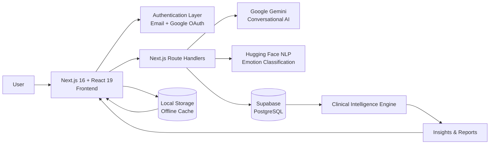

### Architectural Principles

* **Local-first experiences** for fast perceived performance.
* **Serverless execution** for simplified deployment and scalability.
* **Progressive synchronization** between browser cache and Supabase.
* **Composable AI services** with clear responsibilities.
* **User control and transparency** embedded throughout the product.

---

## Workflow

The following sequence illustrates how CogniSync transforms raw user interactions into meaningful outcomes.

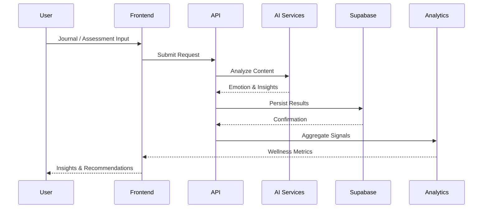

---

## Local-First Synchronization Strategy

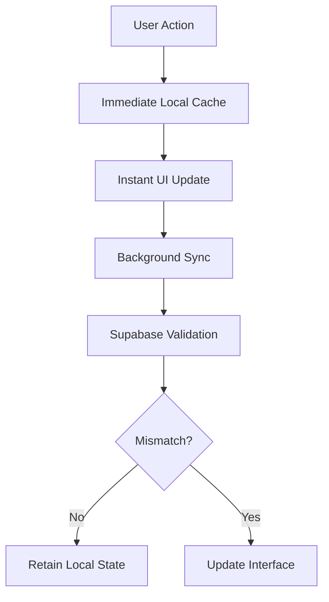

This approach minimizes latency while preserving consistency across sessions and devices.

---

# Tech Stack

| Category               | Technologies                                        |
| ---------------------- | --------------------------------------------------- |
| **Frontend**           | Next.js 16, React 19                                |
| **Styling**            | Tailwind CSS v4, Radix UI                           |
| **Animation**          | Framer Motion, Tailwind Animate                     |
| **Backend**            | Next.js Route Handlers                              |
| **Database**           | Supabase PostgreSQL                                 |
| **Authentication**     | Supabase SSR, Google OAuth 2.0                      |
| **AI / NLP**           | Google Gemini 2.0 Flash, Hugging Face DistilRoBERTa |
| **Data Visualization** | Recharts                                            |
| **Email Services**     | Nodemailer, Gmail SMTP                              |
| **State Management**   | React Context API                                   |
| **Caching**            | Browser LocalStorage                                |
| **Deployment**         | Vercel                                              |
| **Infrastructure**     | Serverless Edge Architecture                        |

---

# Engineering Decisions Worth Noticing

### Local-First by Design

Rather than waiting for remote responses, CogniSync prioritizes responsiveness through immediate browser persistence and deferred synchronization.

---

### AI With Clear Responsibilities

Instead of relying on a single model for everything:

* Hugging Face specializes in deterministic emotion classification.
* Gemini specializes in conversational assistance.

This separation improves reliability and explainability.

---

### Product Before Complexity

Every technical decision ultimately serves a product outcome:

* Faster feedback.
* Lower friction.
* Higher trust.
* Better user understanding.

---

### Graceful Failure Handling

Fallback mechanisms ensure the experience remains usable:

* Cached sessions.
* Background reconciliation.
* Gemini model fallback.
* Offline persistence strategies.

---

# Setup

## Prerequisites

Ensure the following are installed:

* Node.js 20+
* npm or pnpm
* Supabase Project
* Google AI API Key
* Hugging Face API Access

---

## Installation

```bash
git clone https://github.com/adithyachary09/cognisync.git

cd cognisync

npm install
```

---

## Environment Variables

Create a `.env.local` file:

```env
NEXT_PUBLIC_SUPABASE_URL=

NEXT_PUBLIC_SUPABASE_ANON_KEY=

SUPABASE_SERVICE_ROLE_KEY=

GOOGLE_GENERATIVE_AI_API_KEY=

HUGGINGFACE_API_KEY=

EMAIL_USER=

EMAIL_PASSWORD=
```

---

## Run Locally

```bash
npm run dev
```

Open:

```text
http://localhost:3000
```

---

## Build for Production

```bash
npm run build

npm start
```

---

## Usage

1. Create an account or sign in.
2. Complete psychometric assessments.
3. Journal daily experiences.
4. Explore emotional insights.
5. Interact with the AI companion.
6. Review trends and reports.
7. Use regulation tools whenever needed.

From setup to first interaction, the experience is designed to take only a few minutes.

---
# Project Structure

The repository is organized around clear separation of concerns, making it easier to scale, maintain, and onboard contributors.

```text
CogniSync/
│
├── app/                     # Next.js App Router pages & API routes
│   ├── api/                 # Route handlers
│   └── (pages)/             # Feature pages
│
├── components/              # Reusable UI components
│
├── contexts/                # Global state providers
│
├── hooks/                   # Custom React hooks
│
├── lib/                     # Utilities & service integrations
│
├── public/                  # Static assets
│
├── assets/                  # README visuals & branding
│   ├── logo.png
│   ├── page1.png
│   ├── page2.png
│   ├── page3.1.png
│   ├── page3.2.png
│   ├── page4.1.png
│   ├── page4.2.png
│   ├── page5.1.png
│   ├── page5.2.png
│   ├── page6.png
│   ├── page7.png
│   ├── page8.1.png
│   ├── page8.2.png
│   ├── page8.3.png
│   └── page8.4.png
│
├── types/                   # Shared TypeScript definitions
│
├── styles/                  # Global styling
│
├── .env.local
├── package.json
└── README.md
```

---

# Roadmap

Future improvements are focused on expanding real-world value rather than adding unnecessary complexity.

* 📱 Progressive Web App (PWA) support.
* 🌍 Multi-language accessibility.
* 📈 Longitudinal wellness forecasting.
* 👨‍⚕️ Secure clinician sharing workflows.
* ⌚ Wearable device integrations.
* 🧩 Personalized intervention recommendations.

---

# Skills Demonstrated

<table>
<tr>
<td width="50%">

### Software Engineering

* System Design
* Modular Architecture
* State Management
* Error Handling
* Scalability Thinking

</td>

<td width="50%">

### Frontend Engineering

* Next.js App Router
* React 19
* Tailwind CSS
* Framer Motion
* Responsive Design

</td>
</tr>

<tr>
<td width="50%">

### Backend & Infrastructure

* Serverless APIs
* Supabase
* Authentication Flows
* Session Management
* Data Persistence

</td>

<td width="50%">

### AI & Product

* NLP Integration
* Prompt Engineering
* Gemini Integration
* Product Thinking
* User-Centered Design

</td>
</tr>
</table>

---

# Contributions

Contributions, suggestions, and constructive feedback are always welcome.

If you'd like to improve CogniSync:

1. Fork the repository.
2. Create a feature branch.
3. Submit a pull request.
4. Share your reasoning and implementation details.

Thoughtful contributions that improve usability, accessibility, reliability, or developer experience are especially appreciated.

---

<div align="center">

# Connect

<br>

<a href="https://linkedin.com/in/adithya-chary">

</a>

<a href="https://github.com/adithyachary09">

</a>

<a href="https://cognisync.vercel.app/">

</a>

<br><br>

### Author

**Adithya**

Building products where engineering quality and human impact matter equally.

</div>

---

<div align="center">

## CogniSync

### *Understand Better. Support Earlier. Grow Stronger.*

Built with ❤️ by **Adithya**

<br>

<a href="#top">⬆ Back to Top</a>

</div>
